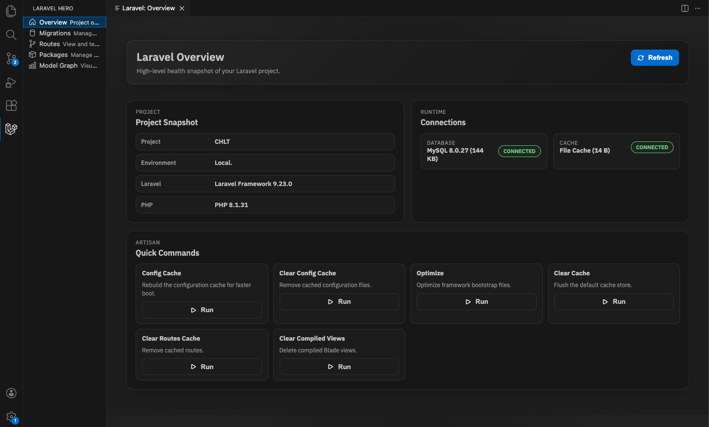

# Laravel Hero - Your Ultimate Laravel Development Companion

  
  
  ### Stop typing commands. Start building faster.
  
  
  
  

---

## Why Laravel Hero?

**Imagine managing your entire Laravel application without ever leaving VS Code.** No terminal juggling. No memorizing artisan commands. Just pure, visual productivity.

Laravel Hero transforms VS Code into a complete Laravel control center. Think of it as your car's dashboard everything you need is right there, beautifully organized, one click away.

---

## 🚀 What Makes This Different?

This isn't another syntax highlighter or snippet pack. **Laravel Hero is a full featured Laravel management interface** built directly into VS Code. 

It's like having a powerful admin panel for your Laravel application, but for developers.

---

## ✨ Features That Will Change Your Workflow

### 📊 **Overview Dashboard - Instant Project Health**

  

**Your Laravel cockpit.** See the essentials before you touch a line of code.

- **Project snapshot** project name, environment, Laravel and PHP versions
- **Connection health** database driver + live connection check, cache driver status
- **One click maintenance** run config cache, config clear, optimize, cache clear, route clear, and view clear right from VS Code
- **VS Code native** same styling, buttons, and alerts as every other panel

*Real world scenario:* You open a legacy project and need to confirm it's wired correctly. One glance shows PHP version, Laravel version, DB connection health, and cache driver. Two clicks cache and config refresh, no terminal hopping.

---

### 🗄️ **Database Migrations - Visual & Effortless**

  

**See every migration at a glance.** Green check marks show what's migrated, circles show what's pending. Like a project management board, but for your database.

- **Create migrations** with a simple dialog no `php artisan` needed
- **Run individual migrations** or execute all pending ones in sequence
- **Rollback with precision** specify exact steps or rollback everything
- **Force re run** for development without touching your terminal
- **Search and sort** through hundreds of migrations instantly
- **Jump to source** with one click

*Real world scenario:* You're onboarding a new developer. Instead of sending them a list of terminal commands, they open Laravel Hero, see exactly what migrations need to run, and click "Run All." Done in 3 seconds.

---

### 🌐 **Routes - Your Application's Road Map**

  

**Every route in your application, beautifully organized.** Think of it as Google Maps for your API endpoints.

- **Visual route explorer** with methods, URIs, names, middleware, and permissions
- **Smart search** across everything—find that one protected route instantly
- **Copy URLs** to clipboard for quick API testing
- **Middleware insights** see compact chips, click to expand full namespaces
- **Export to CSV** for documentation or client reviews
- **Responsive table** that handles hundreds of routes smoothly

*Real world scenario:* Client asks "Which routes require authentication?" You search "auth" in Laravel Hero, export the CSV, send it over. 10 seconds vs 10 minutes of grep commands.

---

### 📦 **Packages - Dependency Intelligence**

  

**Know exactly what's in your project.** Like checking your car's maintenance schedule see what needs updating before problems arise.

- **All packages at a glance** - production and dev dependencies
- **Update alerts** - see which packages have newer versions
- **Deprecation warnings** - get replacement suggestions automatically
- **Jump to Packagist** - with one click for full documentation
- **Search and sort** - find specific packages in massive projects
- **Version comparison** - installed vs latest, color coded

*Real world scenario:* Security audit due tomorrow. Open Packages, instantly spot deprecated packages and available updates. Update critical ones, document the rest. Task done before your coffee gets cold.

---

### 🕸️ **Model Relationship Graph - See Your Data Structure**

  

**Visualize your entire data architecture.** Like an architect's blueprint, but for your database relationships.

- **ER style diagrams** - showing all models and their connections
- **Relationship labels** - one-to-one, one-to-many, many-to-many, polymorphic
- **Interactive canvas** - drag, zoom, pan with collision free layouts
- **Smart positioning** - most connected models centered automatically
- **Double click to open** - jump directly to model files
- **Intelligent search** - find models and highlight their relationships
- **Direction indicators** - see which side is "one" vs "many"

*Real world scenario:* New team member asks "How do Users relate to Posts and Comments?" You open the graph, zoom to User, and they see the entire relationship chain visually. Explanation done without saying a word.

---

## 🎯 Built for Real Developers

**No learning curve.** If you know Laravel, you already know how to use Laravel Hero.

- **Native VS Code integration** - feels like it's always been there
- **Instant updates**  changes reflect immediately, no refresh needed
- **Smart defaults** - works perfectly out of the box
- **Custom PHP paths** - supports any development environment
- **Detailed logging** - see exactly what's happening when needed
- **Production quality code** - TypeScript, tested, following VS Code best practices

---

## 🏃 Get Started in 30 Seconds

1. Install **Laravel Hero** from VS Code Extensions
2. Click the Laravel Hero icon in your sidebar
3. Start with the **Overview** panel to validate environment, then manage migrations, routes, packages, and models visually

**That's it.** No configuration. No setup wizards. Just instant productivity.

---

## 💪 What Developers Are Saying

> *"I haven't opened a terminal for migrations in weeks. This is insane."*

> *"The model graph saved me hours of documentation reading."*

> *"Finally, a Laravel extension that actually does something useful."*

---

## 🛠️ Requirements

- **VS Code** 1.107.0+
- **Laravel project** with artisan
- **PHP** 7.4+
- **Composer** (for package features)

---

## 🤝 Open Source & Growing

Laravel Hero is MIT licensed and actively maintained. We welcome contributions, feature requests, and bug reports.

- **Found a bug?** [Report it](https://github.com/munasinha/vscode-laravel-hero/issues)
- **Have an idea?** [Discuss it](https://github.com/munasinha/vscode-laravel-hero/discussions)
- **Want to contribute?** Check [CONTRIBUTING.md](https://github.com/munasinha/vscode-laravel-hero/blob/master/CONTRIBUTING.md)

---

## 📝 License

MIT License - Free to use, modify, and distribute. See [LICENSE](LICENSE) for details.

---

### Ready to transform your Laravel workflow?

**⭐ Star us on [GitHub](https://github.com/munasinha/vscode-laravel-hero)**

**📦 Install from [VS Code Marketplace](https://marketplace.visualstudio.com/items?itemName=navod-rashmika.laravel-hero)**

---

*Made with ❤️ for Laravel developers who value their time*

