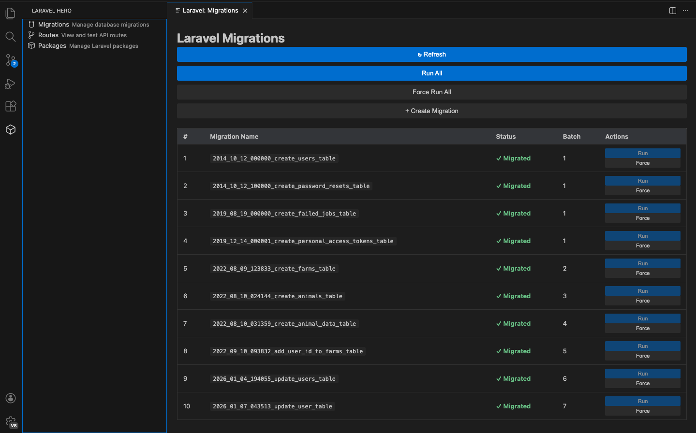
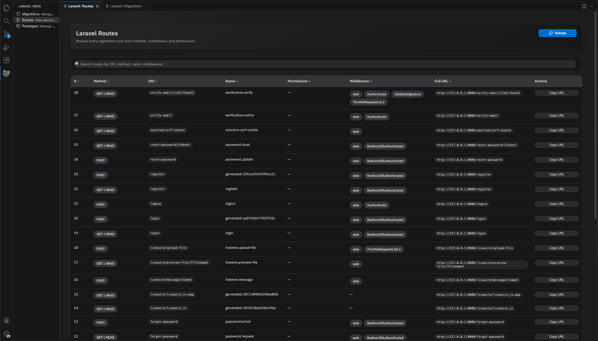
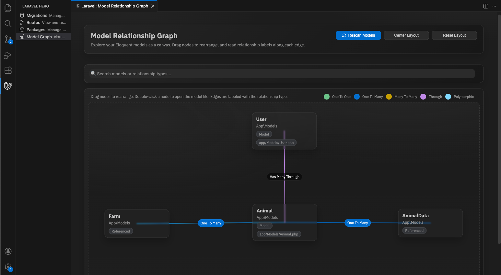
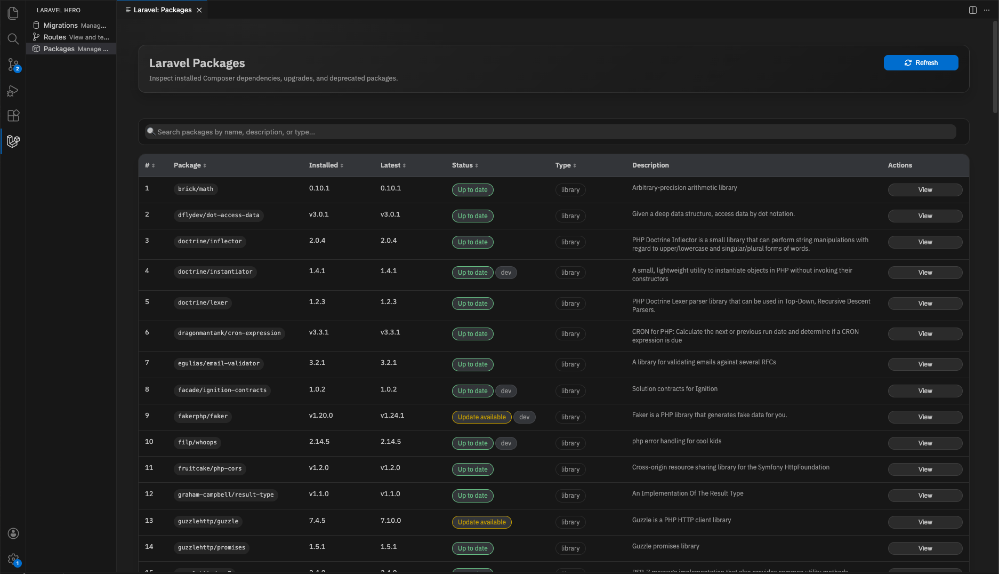

# Laravel Hero

  

**Supercharge Your Laravel Development Workflow in VS Code**

---

## What is Laravel Hero?

[Laravel Hero](https://marketplace.visualstudio.com/items?itemName=navod-rashmika.laravel-hero) is your ultimate VS Code companion for Laravel development. Stop switching between your editor and terminal manage your entire Laravel application directly from VS Code with an intuitive, powerful interface.

Migrations, Routes, **Packages**, and the new **Model Relationship Graph** are available today: explore Eloquent/Authenticatable models visually (zoom, pan, collision-free by default), view installed Composer dependencies, detect upgrades/deprecations, and jump to Packagist.

---

## ✨ Key Features

### 🕸️ **Model Relationship Graph (New)**
- **Visual ER-style canvas** for all model classes (including `Authenticatable`) with labeled relationships (one-to-one, one-to-many, many-to-many, through, polymorphic)
- **Drag, pan, zoom** (wheel + floating zoom buttons) with center/reset controls; collision avoidance is always on
- **Smart layout** centers the most-connected models, separates isolates, and scales to very large graphs with auto-sized grid layouts
- **Inline directionality** — single label per edge with `1 / ∞` badges to show one-to-many sides
- **Model-aware actions** — double-click a node to open the model file; search by model name, namespace, or relationship type
- **Native Laravel Hero styling** that matches the existing Migrations, Routes, and Packages panels

### 📦 **Packages Viewer (New)**
- **List installed packages** (prod + dev) from `composer.lock`
- **Upgrade awareness** via `composer outdated --direct --format=json` (with graceful warnings if unavailable)
- **Deprecation warnings** with suggested replacements when present
- **Open in Packagist** with one click
- **Search and sort** across name, version, type, status, and description

### 🌐 **Routes Viewer**
- **List all routes** with methods, URI, name, middleware, permissions, and full URL
- **Search and sort** across all columns
- **Middleware chips** show class name by default; click to expand full namespace
- **Copy URL** quickly from the table
- **Export CSV** for the current route list
- **Responsive table** with wrapping for long middleware/URLs and sticky headers with scroll

### 🗄️ **Database Migrations Management**
- **View all migrations** in a clean, organized interface
- **Track status** at a glance see which migrations are pending and which have been applied
- **Run migrations** with a single click no terminal needed
- **Create new migrations** instantly through an intuitive dialog
- **Force re-run migrations** for development and testing
- **Auto-refresh** after every operation
- **Offline mode** still see your migrations even if Laravel commands are unavailable
### 📊 **Advanced Datatable**
- **Search migrations** in real-time across names, statuses, and batches
- **Sort all columns** with visual up/down indicators
- **View original index** that persists even when sorted
- **Quick file access** with one-click navigation to migration source code

### ⟲ **Rollback Migrations**
- **Rollback all migrations** instantly with optional step control
- **Individual rollback** for specific migrations with confirmation
- **Smart button states** — rollback disabled for unmigrated migrations
- **Batch control** — specify how many steps to rollback (0 or empty = all)
### 🎯 **Built for Developers**
- **Native VS Code UI** — feels like part of the editor, not a plugin
- **Detailed logging** — see exactly what's happening in the "Laravel Hero" output panel
- **Custom PHP paths** — support for any PHP installation
- **Smart error handling** — helpful messages when things go wrong
- **Production-ready code** — built with TypeScript, tested, and following VS Code best practices

---

## 🚀 Getting Started

### Installation (30 seconds)
1. Open **Extensions** in VS Code (`Cmd+Shift+X` on Mac, `Ctrl+Shift+X` on Windows)
2. Search for **"Laravel Hero"**
3. Click **Install**
4. Click the Laravel Hero icon in the Activity Bar (left sidebar)
5. Select **Migrations**, **Routes**, or **Packages** to get started

### Requirements
- **VS Code** 1.107.0 or later
- **Laravel project** with `artisan` binary
- **PHP** 7.4+ installed
- **Composer** (for package insights)

---

# Migration Manager

1. Click the **Laravel Hero icon** in the Activity Bar
2. Select **Migrations**
3. Your webview panel opens showing all database migrations
4. Green checkmarks mean **migrated**, circles mean **pending**

  

### Run a Migration
- Click **"Run"** on any pending migration → Confirm → Done! ✓

### Run All Pending Migrations
- Click **"Run All"** at the top → Confirm → Watch them execute in sequence

### Create a New Migration
1. Click **"+ Create Migration"**
2. Type your migration name (e.g., `create_users_table`)
3. Press Enter
4. Your new migration appears instantly (Pending status)

### Force Re-run a Migration
- Click **\"Force Run All\"** on any migration
- Perfect for development and debugging
- Works on already-migrated migrations

### Search & Sort Migrations
- Use the **🔍 search bar** to filter migrations by name, status, or batch
- Click any **column header** to sort (click again to reverse)
- Visual indicators show which column is currently sorted

### Open Migration Files
- Click the **📄 Open** button in the File column
- Opens the migration source code directly in your editor
- No need to hunt through the database/migrations folder

### Rollback Migrations
- Click **\"⟲ Rollback All\"** to open the rollback modal
- Specify how many steps to rollback (0 or empty = rollback all)
- Individual migrations show **⟲ Rollback** button (enabled only for migrated ones)
- Confirm and watch the rollback execute

---

# Routes Manager

1. Click the **Laravel Hero icon** in the Activity Bar
2. Select **Routes**
3. Browse all routes with methods, name, middleware, permissions, and full URL
4. **Search** and **sort** any column; long middleware and URLs wrap gracefully
5. Click a middleware chip to expand its full namespace
6. Use **Copy URL** to send the route URL to your clipboard
7. Click **Export CSV** to download the current route list

  

---

# Model Relationship Graph

1. Click the **Laravel Hero icon** in the Activity Bar
2. Select **Model Graph**
3. A canvas opens with every detected model (classes extending `Illuminate\Database\Eloquent\Model` or `Authenticatable`)
4. Drag nodes to reorganize the layout; edges stay connected and labeled by relationship type

- Use the floating zoom buttons (or mouse wheel) and pan-drag anywhere on the canvas; layouts are collision-free by default
- Click **Rescan Models** to refresh after code changes
- Use **Center Layout** or **Reset Layout** to tidy the canvas
- Single label per edge with `1 / ∞` markers to show one-to-many direction
- Double-click any node to open its PHP file in the editor
- Search by model name, namespace, or relationship type to quickly highlight parts of the graph (matches + first-degree neighbors stay visible)

  

---

# Package Manager 

1. Click the **Laravel Hero icon** in the Activity Bar
2. Select **Packages**
3. Browse all installed Composer packages (prod + dev)
4. See **Installed vs Latest** versions, **Deprecated** badges, and **Update available** chips
5. Search/sort by name, version, type, or description
6. Click **View** to open the package on Packagist
7. If `composer outdated` cannot run, a warning banner explains why (data still loads from `composer.lock`)

  

---

## ⚙️ Configuration

### Using a Custom PHP Path?
Some setups have PHP in non-standard locations. Configure it:

1. Open **Settings** (`Cmd+,` on Mac, `Ctrl+,` on Windows)
2. Search for **"laravel hero"**
3. Set `laravelHero.phpCommand` to your PHP path:
   - Examples: `/opt/homebrew/bin/php`, `/usr/bin/php`, `C:\php\php.exe`

That's it! Laravel Hero will now use your custom PHP installation.

---

## 🐛 Troubleshooting

| Problem | Solution |
|---------|----------|
| **Migrations won't load** | Ensure your Laravel project has `database/migrations` folder and run `composer install` |
| **"PHP not found" error** | Install PHP or set `laravelHero.phpCommand` in settings to your PHP path |
| **No sidebar icon appearing** | Reload VS Code (`Cmd+R`) and make sure a folder is open |
| **Artisan commands timing out** | Check your Laravel project permissions and network (if remote) |
| **Need more details?** | Check the Laravel Hero output channel (`Cmd+Shift+U`) for detailed logs |

---

## 🎯 What's Coming Next?

### Phase 2: Routes Management (Shipped)
- View all application routes with methods, names, middleware, permissions
- Search/sort, responsive table with sticky headers, copy full URLs, toggle middleware namespaces
- Export CSV of the current routes list
- More route testing tools coming soon

### Phase 3: Upcoming Enhancements
- Package update helpers and bulk actions
- Database insights and connection status
- Artisan command runner

---

## 🤝 Want to Help?

We're open source and love contributions! Whether it's bug reports, feature suggestions, or code contributions—we welcome all help.

### Quick Links
- **Found a bug?** [Report it on GitHub](https://github.com/munasinha/vscode-laravel-hero/issues)
- **Have an idea?** [Start a discussion](https://github.com/munasinha/vscode-laravel-hero/discussions)
- **Want to code?** Check [CONTRIBUTING.md](https://github.com/munasinha/vscode-laravel-hero/blob/master/CONTRIBUTING.md) for the full guide

---

## 📝 License

MIT License - See [LICENSE](LICENSE) for details. Free to use, modify, and distribute.

---

## ❤️ Made for Laravel Developers

Laravel Hero was built with a passion for Laravel development and a commitment to making your workflow seamless and enjoyable.

**If you find this extension useful, please give it a ⭐ on [GitHub](https://github.com/munasinha/vscode-laravel-hero)**

---

### More Resources
- [Laravel Documentation](https://laravel.com/docs)
- [VS Code Extension API](https://code.visualstudio.com/api)
- [GitHub Repository](https://github.com/munasinha/vscode-laravel-hero)

---

**Questions?** Open an issue or start a discussion on GitHub. We're here to help!
